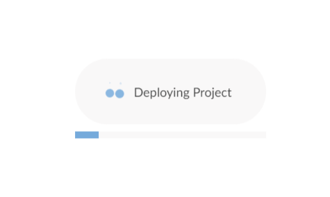

# HUP Pathology R Workshop

## Welcome!

This introductory R workshop aims to teach participants with little or no programming experience the basics of the R statistical programming language for reproducible laboratory data analytics. R is a freely available programming environment that is aimed squarely at common activities in data analysis including complex data manipulation, statistical analysis, automation, and publication-quality data visualization. We will introduce basic concepts of R programming as well as more generalizable best practices in working with laboratory data.

-   Instructors:

    -   [Daniel Herman](http://pathology.med.upenn.edu/department/people/906/daniel-s-herman)
    -   [Stephan Kadauke](https://www.linkedin.com/in/skadauke/)
    -   [Amrom Obstfeld](https://www.chop.edu/doctors/obstfeld-amron)
    -   [Patrick Mathias](https://www.linkedin.com/in/pcmathias/) (remote)
    -   [Joseph Rudolf](https://healthcare.utah.edu/fad/mddetail.php?physicianID=u6005682&name=joseph-w-rudolf) (remote)

## Before you arrive

### Get Ready...

  
Click to expand!

For the best experience, please have the following ready before the workshop begins:

-   *Preferably* two monitors (or two laptops), one for the Zoom conference software, and one in which you will work. Otherwise you'll have a bunch of switching back and forth.

-   Install the latest version of [Zoom](https://zoom.us/download).

-   Install the latest version of [Google Chrome](https://www.google.com/chrome/) as some [older browsers](https://support.rstudio.com/hc/en-us/articles/227449447-Supported-browsers-for-RStudio-Connect) may not be compatible with the RStudio application).

### Get Set...

  
Click to expand!

-   We will be using RStudio Cloud as our training environment.
    -   Please sign up for a free account [here](https://rstudio.cloud/).
        -   After logging in you should see a screen like this:

            

    -   Then use [this](https://rstudio.cloud/project/3364717 "Rstudio Cloud") link to access our Workshop Project
        -   You should see a spinny icon like this:

            

    -   Then you'll then see a full RStudio Screen like this:

        

    -   Finally, on the upper right, you'll see text that says "TEMPORARY COPY. Save a Permanent Copy" Press the text that says "Save a Permanent Copy".

        

    -   You're Done!

-   Calendar invites with Zoom details were sent out last week.

-   Please complete the following survey so we can better understand your R experience and what you want out of the course: [API R Workshop Participant Survey](https://forms.gle/Xe3U71ZBZRmrP2E87).

### Go!

  
Click to expand!

The workshop is scheduled to begin on 12/20 at 3 pm ET. It will run at the same time from 12/20-12/23.

Please make every effort to log into the Zoom conference 5 - 10 minutes early to allow time to get settled, ensure your computer audio and video is set up, and get RStudio cloud up and running.

## Accessing/interacting with the course content

1.  Course content will be pre-loaded in the RStudio instance and is available for download there as a .zip file.
2.  The content is available at [our course github page](https://github.com/amromeo/hup_path_r_workshop) and can be downloaded from there as well.

## A note on the mechanics and etiquette of the virtual workshop

-   Please refrain from screen grabbing other user's information, recording the workshop, or otherwise disrupting the flow of the Zoom Meeting.
-   Please exercise appropriate Zoom etiquette by muting your microphone during sessions. Breakout sessions will be used for those who request additional one-one-one assistance during exercises.

## IMPORTANT: Installing RStudio onto your own computer

We will be utilizing our cloud based RStudio instance in the workshop. However, *in the long term*, you will need R and RStudio installed **on your own computer** in order to work on private data. You can find step by step instructions for installing these on macOS ([here](https://www.youtube.com/watch?v=GM88tYlEy_g)) or Windows ([here](https://www.youtube.com/watch?v=JRKmZK5-6aE)).

## Acknowledgments

  
Click to expand!

All of the course instructors have previous experience implementing and executing R workshops at a variety of venues. The workshop we are presenting for the trainees at HUP is in many ways a product of these past experiences. The workshop also integrates content, best practices, and lessons from a variety of educators in the R community. We would like to specifically acknowledge:

-   Joe Rudolf and Patrick Mathias who permitted us to use their recordings for this workshop!
-   [MSACL Data Science 201](https://github.com/pcmathias/MSACL-intermediate-R-course), a course produced by Patrick Mathias and several collaborators, presented at the Mass Spectrometry: Applications to the Clinical Lab meeting.
-   Stephan Kadauke's R workshop for Pathology trainees and faculty, developed at the Massachusetts General Hospital and the Hospital of the University of Pennsylvania
-   Steve Master and Dan Holmes's AACC Introduction to R Workshop
-   [Data Science in the Tidyverse](https://github.com/AmeliaMN/data-science-in-tidyverse), a RStudio course with materials posted online
-   [R for Data Science](http://r4ds.had.co.nz/index.html), the online textbook by Garrett Grolemund and Hadley Wickham, is invaluable in navigating the tidyverse and learning R in general
-   Blog posts and documentation by [Jenny Bryan](https://github.com/jennybc) helped steer the project content and as well as some discussion about packages
-   Amy Willis' [Advanced R Course repository](https://github.com/adw96/biostat561) as a resource for understanding content in a longer, advanced R course
-   Keith Baggerly and Karl Broman's [Reproducible Research](https://github.com/kabagg/sisbid_2018_rr) module at the [Summer Institute in Statistics for Big Data](https://www.biostat.washington.edu/suminst/sisbid) - a big thank you to Keith Baggerly for all of his input and guidance!
-   Greg Wilson's [Teaching Tech Together](http://teachtogether.tech/en/), which offers practical advice about teaching programming.
-   Claus Wilke's [Fundamentals of Data Visualization](https://serialmentor.com/dataviz/), a compendium of Do's and Don'ts of data visualization.
-   Method validation and some other content has been borrowed from the [basic R course at AACC](https://github.com/pcmathias/AACC-Introduction-to-R)

    

    
## License

All of the material in this GitHub repository is copyrighted under the [Creative Commons BY-SA 4.0](https://creativecommons.org/licenses/by-sa/4.0/) copyright to make the material easy to reuse. We encourage you to reuse it and adapt it for your own teaching as you like!
